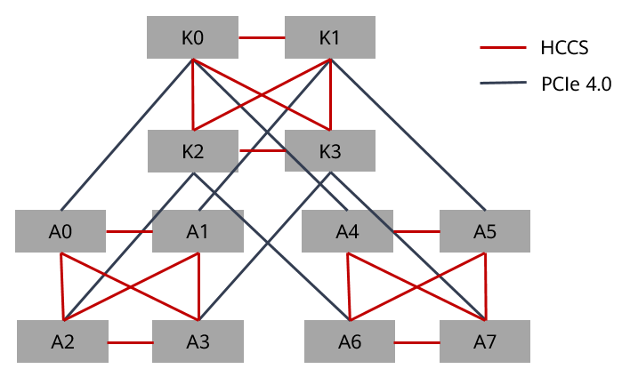

# NPU亲和性调度算法设计说明与开发指导.zh
-   [Ascend-volcano-plugin介绍](#Ascend-volcano-plugin介绍.md)
-   [亲和性策略说明](#亲和性策略说明.md)
-   [调度算法设计说明](#调度算法设计说明.md)
-   [调度算法实现说明](#调度算法实现说明.md)
-   [目录结构](#目录结构.md)
-   [编译说明](#编译说明.md)
-   [版本更新记录](#版本更新记录.md)
<h2 id="Ascend-volcano-plugin介绍.md">Ascend-volcano-plugin介绍</h2>

基于开源Volcano调度的插件机制，增加昇腾处理器的亲和性调度，虚拟设备调度等特性，最大化发挥昇腾处理器计算性能。

<h2 id="亲和性策略说明.md">亲和性策略说明</h2>

## 昇腾910 AI处理器亲和性规则<a name="section14879332111413"></a>

昇腾910 AI处理器是华为研发的一款高性能AI处理器。其内部的处理器之间采用HCCS方式连接。每台物理设备具备8颗处理器，两个HCCS。每个HCCS存在4颗处理器，同一HCCS内处理器可做数据交换，不同HCCS内处理器不能通信，即同一Pod分配的昇腾910 AI处理器（若小于等于4）必须在同一个HCCS环内，否则任务运行失败。昇腾910 AI处理器的互联拓扑图如[图1](#fig997414281914)所示。

**图 1** Ascend 910 AI Processor  interconnection topology<a name="fig997414281914"></a>  


> **说明：** 
>图中A0\~A7为昇腾910 AI处理器。

## 亲和性策略说明<a name="section1024522919366"></a>

针对昇腾910 AI处理器的特征和资源利用的规则，制定昇腾910 AI处理器的亲和性策略如[表1](#table644103781119)所示。

**表 1** 昇腾910 AI处理器亲和性策略说明

<a name="table644103781119"></a>
<table><thead align="left"><tr id="row12441737121113"><th class="cellrowborder" valign="top" width="10.35103510351035%" id="mcps1.2.4.1.1"><p id="p583914346125"><a name="p583914346125"></a><a name="p583914346125"></a>优先级</p>
</th>
<th class="cellrowborder" valign="top" width="20.072007200720073%" id="mcps1.2.4.1.2"><p id="p9839163421215"><a name="p9839163421215"></a><a name="p9839163421215"></a>策略名称</p>
</th>
<th class="cellrowborder" valign="top" width="69.57695769576956%" id="mcps1.2.4.1.3"><p id="p1183973414121"><a name="p1183973414121"></a><a name="p1183973414121"></a>详细内容</p>
</th>
</tr>
</thead>
<tbody><tr id="row1544143719118"><td class="cellrowborder" valign="top" width="10.35103510351035%" headers="mcps1.2.4.1.1 "><p id="p65701144151214"><a name="p65701144151214"></a><a name="p65701144151214"></a>1</p>
</td>
<td class="cellrowborder" valign="top" width="20.072007200720073%" headers="mcps1.2.4.1.2 "><p id="p15708447120"><a name="p15708447120"></a><a name="p15708447120"></a>HCCS亲和性调度原则</p>
</td>
<td class="cellrowborder" valign="top" width="69.57695769576956%" headers="mcps1.2.4.1.3 "><a name="ul358513316613"></a><a name="ul358513316613"></a><ul id="ul358513316613"><li>如果申请<span id="ph102514522379"><a name="ph102514522379"></a><a name="ph102514522379"></a>昇腾910 AI处理器</span>个数为1，则选择同一HCCS，剩余可用的<span id="ph3545191818389"><a name="ph3545191818389"></a><a name="ph3545191818389"></a>昇腾910 AI处理器</span>数量为1个的最佳，其次是剩余3个的为次佳，然后是剩余2个，最后是剩余4个。</li><li>如果申请<span id="ph12846122720397"><a name="ph12846122720397"></a><a name="ph12846122720397"></a>昇腾910 AI处理器</span>个数为2，则选择同一HCCS剩余可用的<span id="ph673153064114"><a name="ph673153064114"></a><a name="ph673153064114"></a>昇腾910 AI处理器</span>数量2个的为最佳，其次是剩余4个，最后是剩余3个。</li><li>如果申请<span id="ph107551285403"><a name="ph107551285403"></a><a name="ph107551285403"></a>昇腾910 AI处理器</span>个数为4，则必须选择同一HCCS剩余可用的<span id="ph101010328402"><a name="ph101010328402"></a><a name="ph101010328402"></a>昇腾910 AI处理器</span>数量为4个。</li><li>如果申请<span id="ph7220141118409"><a name="ph7220141118409"></a><a name="ph7220141118409"></a>昇腾910 AI处理器</span>个数为8，则申请节点所有8个<span id="ph18561524104212"><a name="ph18561524104212"></a><a name="ph18561524104212"></a>昇腾910 AI处理器</span>。</li></ul>
</td>
</tr>
<tr id="row134514378111"><td class="cellrowborder" valign="top" width="10.35103510351035%" headers="mcps1.2.4.1.1 "><p id="p95701244191213"><a name="p95701244191213"></a><a name="p95701244191213"></a>2</p>
</td>
<td class="cellrowborder" valign="top" width="20.072007200720073%" headers="mcps1.2.4.1.2 "><p id="p25701844191218"><a name="p25701844191218"></a><a name="p25701844191218"></a>优先占满调度原则</p>
</td>
<td class="cellrowborder" valign="top" width="69.57695769576956%" headers="mcps1.2.4.1.3 "><p id="p257014461213"><a name="p257014461213"></a><a name="p257014461213"></a>优先分配已经分配过<span id="ph674816913476"><a name="ph674816913476"></a><a name="ph674816913476"></a>昇腾910 AI处理器</span>的AI服务器，减少碎片。</p>
<a name="ul492757985"></a><a name="ul492757985"></a><ul id="ul492757985"><li>如果申请1个<span id="ph5472151794717"><a name="ph5472151794717"></a><a name="ph5472151794717"></a>昇腾910 AI处理器</span>，优先申请capacity为8，且HCCS剩余可用处理器数量为1的节点，然后是剩余可用数量为3个，2个，4个。</li><li>如果申请2个<span id="ph113619244488"><a name="ph113619244488"></a><a name="ph113619244488"></a>昇腾910 AI处理器</span>，优先申请capacity为8，且HCCS剩余可用处理器数量为2的节点，然后是剩余可用数量为4个，3个。</li><li>如果申请4个<span id="ph1227621912495"><a name="ph1227621912495"></a><a name="ph1227621912495"></a>昇腾910 AI处理器</span>，优先申请capacity为8，且剩余可用处理器数量为4的节点。</li><li>如果申请<span id="ph8889713185018"><a name="ph8889713185018"></a><a name="ph8889713185018"></a>昇腾910 AI处理器</span>为8的正整数倍数，申请capacity为8，且已使用0个处理器的节点。</li></ul>
</td>
</tr>
<tr id="row645123716115"><td class="cellrowborder" valign="top" width="10.35103510351035%" headers="mcps1.2.4.1.1 "><p id="p1157004414125"><a name="p1157004414125"></a><a name="p1157004414125"></a>3</p>
</td>
<td class="cellrowborder" valign="top" width="20.072007200720073%" headers="mcps1.2.4.1.2 "><p id="p5570154418121"><a name="p5570154418121"></a><a name="p5570154418121"></a>剩余偶数优先原则</p>
</td>
<td class="cellrowborder" valign="top" width="69.57695769576956%" headers="mcps1.2.4.1.3 "><p id="p175701445129"><a name="p175701445129"></a><a name="p175701445129"></a>优先选择满足1~3条件的HCCS，然后选择剩余处理器数量为偶数的HCCS。</p>
</td>
</tr>
<tr id="row15617913135"><td class="cellrowborder" valign="top" width="10.35103510351035%" headers="mcps1.2.4.1.1 "><p id="p4618141141310"><a name="p4618141141310"></a><a name="p4618141141310"></a>--</p>
</td>
<td class="cellrowborder" valign="top" width="20.072007200720073%" headers="mcps1.2.4.1.2 "><p id="p13570104491211"><a name="p13570104491211"></a><a name="p13570104491211"></a>多节点支持原则</p>
</td>
<td class="cellrowborder" valign="top" width="69.57695769576956%" headers="mcps1.2.4.1.3 "><p id="p861812114139"><a name="p861812114139"></a><a name="p861812114139"></a>一次训练任务只支持8*N的方式分配。</p>
</td>
</tr>
</tbody>
</table>

## 资源申请约束<a name="section1103513532"></a>

根据业务模型，对训练任务的要求如下：

1.  当训练任务申请昇腾910 AI处理器数量不大于4个时，需要将所需的昇腾910 AI处理器调度到同一个HCCS内。
2.  当训练任务申请的昇腾910 AI处理器数量为8个时，需要将节点的昇腾910 AI处理器分配给该任务。
3.  当申请的NPU数量大于8个时，申请数量只能是8\*N（N\>=1）个。
4.  当训练任务申请的昇腾910 AI处理器数量不大于8时，只能申请一个Pod。大于8则每个Pod为8个昇腾910 AI处理器。
5.  当训练任务申请虚拟设备vNPU时，申请数量只能为1。
6.  遵循Volcano开源部分的其他约束。

<h2 id="调度算法设计说明.md">调度算法设计说明</h2>

## 场景分类<a name="section17611254115419"></a>

根据亲和性策略和业务模型设计梳理出场景如[表1](#table34241172175)所示。

> **说明：** 
>-   A\~D列4个分组，表示处理器选取时，满足处理器选取的四种HCCS情况。优先级逐次递减，即当A中不满足时，才会选择B，C，D。
>-   当组内满足HCCS时节点的情况。‘\~’左边为满足要求的HCCS，右边为另一个HCCS的处理器剩余情况。如对于1个处理器申请的A组情况：另一个HCCS可能为0、1、2、3、4五种处理器剩余情况。其代表的节点优先级也依次减小。
>-   8颗及其以上处理器适用于4颗及其以下的情况。且均放在A组，且需要全部占用。

**表 1**  亲和性策略场景列表

<a name="table34241172175"></a>
<table><thead align="left"><tr id="row164241173174"><th class="cellrowborder" valign="top" width="8.280000000000001%" id="mcps1.2.8.1.1"><p id="p152201253161715"><a name="p152201253161715"></a><a name="p152201253161715"></a><strong id="b12201553141713"><a name="b12201553141713"></a><a name="b12201553141713"></a>场景序号</strong></p>
</th>
<th class="cellrowborder" valign="top" width="11.72%" id="mcps1.2.8.1.2"><p id="p0220115391713"><a name="p0220115391713"></a><a name="p0220115391713"></a><strong id="b13220175311711"><a name="b13220175311711"></a><a name="b13220175311711"></a>任务申请芯片数</strong></p>
</th>
<th class="cellrowborder" valign="top" width="18.860000000000003%" id="mcps1.2.8.1.3"><p id="p152201953111710"><a name="p152201953111710"></a><a name="p152201953111710"></a><strong id="b32200535173"><a name="b32200535173"></a><a name="b32200535173"></a>A（节点中处理器剩余数）</strong></p>
</th>
<th class="cellrowborder" valign="top" width="15.400000000000002%" id="mcps1.2.8.1.4"><p id="p32211653191716"><a name="p32211653191716"></a><a name="p32211653191716"></a><strong id="b62211753161717"><a name="b62211753161717"></a><a name="b62211753161717"></a>B</strong></p>
</th>
<th class="cellrowborder" valign="top" width="13.770000000000001%" id="mcps1.2.8.1.5"><p id="p3221175312177"><a name="p3221175312177"></a><a name="p3221175312177"></a><strong id="b1222116535179"><a name="b1222116535179"></a><a name="b1222116535179"></a>C</strong></p>
</th>
<th class="cellrowborder" valign="top" width="15.970000000000004%" id="mcps1.2.8.1.6"><p id="p12221145371719"><a name="p12221145371719"></a><a name="p12221145371719"></a><strong id="b12221175317177"><a name="b12221175317177"></a><a name="b12221175317177"></a>D</strong></p>
</th>
<th class="cellrowborder" valign="top" width="16.000000000000004%" id="mcps1.2.8.1.7"><p id="p0221155316175"><a name="p0221155316175"></a><a name="p0221155316175"></a>备注</p>
</th>
</tr>
</thead>
<tbody><tr id="row4424317151713"><td class="cellrowborder" valign="top" width="8.280000000000001%" headers="mcps1.2.8.1.1 "><p id="p1822165310172"><a name="p1822165310172"></a><a name="p1822165310172"></a>1</p>
</td>
<td class="cellrowborder" valign="top" width="11.72%" headers="mcps1.2.8.1.2 "><p id="p1122145319175"><a name="p1122145319175"></a><a name="p1122145319175"></a>1</p>
</td>
<td class="cellrowborder" valign="top" width="18.860000000000003%" headers="mcps1.2.8.1.3 "><p id="p18221195381715"><a name="p18221195381715"></a><a name="p18221195381715"></a>1~[0、1、2、3、4]</p>
</td>
<td class="cellrowborder" valign="top" width="15.400000000000002%" headers="mcps1.2.8.1.4 "><p id="p5221105315174"><a name="p5221105315174"></a><a name="p5221105315174"></a>3~[0、2、3、4]</p>
</td>
<td class="cellrowborder" valign="top" width="13.770000000000001%" headers="mcps1.2.8.1.5 "><p id="p122211353121711"><a name="p122211353121711"></a><a name="p122211353121711"></a>2~[0、2、4]</p>
</td>
<td class="cellrowborder" valign="top" width="15.970000000000004%" headers="mcps1.2.8.1.6 "><p id="p152210538179"><a name="p152210538179"></a><a name="p152210538179"></a>4~[0、4]</p>
</td>
<td class="cellrowborder" rowspan="3" valign="top" width="16.000000000000004%" headers="mcps1.2.8.1.7 "><p id="p52212053191710"><a name="p52212053191710"></a><a name="p52212053191710"></a>然后选择capacity为7，坏的视为已使用，重复A~D</p>
</td>
</tr>
<tr id="row8425141731712"><td class="cellrowborder" valign="top" headers="mcps1.2.8.1.1 "><p id="p5221185391719"><a name="p5221185391719"></a><a name="p5221185391719"></a>2</p>
</td>
<td class="cellrowborder" valign="top" headers="mcps1.2.8.1.2 "><p id="p42221531172"><a name="p42221531172"></a><a name="p42221531172"></a>2</p>
</td>
<td class="cellrowborder" valign="top" headers="mcps1.2.8.1.3 "><p id="p132224533174"><a name="p132224533174"></a><a name="p132224533174"></a>2~[0、1、2、3、4]</p>
</td>
<td class="cellrowborder" valign="top" headers="mcps1.2.8.1.4 "><p id="p1422275316178"><a name="p1422275316178"></a><a name="p1422275316178"></a>4~[0、1、3、4]</p>
</td>
<td class="cellrowborder" valign="top" headers="mcps1.2.8.1.5 "><p id="p3222553141720"><a name="p3222553141720"></a><a name="p3222553141720"></a>3~[0、1]</p>
</td>
<td class="cellrowborder" valign="top" headers="mcps1.2.8.1.6 "><p id="p5222153181713"><a name="p5222153181713"></a><a name="p5222153181713"></a>-</p>
</td>
</tr>
<tr id="row94251317191720"><td class="cellrowborder" valign="top" headers="mcps1.2.8.1.1 "><p id="p0222753121719"><a name="p0222753121719"></a><a name="p0222753121719"></a>3</p>
</td>
<td class="cellrowborder" valign="top" headers="mcps1.2.8.1.2 "><p id="p1622285341715"><a name="p1622285341715"></a><a name="p1622285341715"></a>4</p>
</td>
<td class="cellrowborder" valign="top" headers="mcps1.2.8.1.3 "><p id="p622210534170"><a name="p622210534170"></a><a name="p622210534170"></a>4~[0、1、2、3、4]</p>
</td>
<td class="cellrowborder" valign="top" headers="mcps1.2.8.1.4 "><p id="p142221653131719"><a name="p142221653131719"></a><a name="p142221653131719"></a>-</p>
</td>
<td class="cellrowborder" valign="top" headers="mcps1.2.8.1.5 "><p id="p022205310177"><a name="p022205310177"></a><a name="p022205310177"></a>-</p>
</td>
<td class="cellrowborder" valign="top" headers="mcps1.2.8.1.6 "><p id="p20222155312171"><a name="p20222155312171"></a><a name="p20222155312171"></a>-</p>
</td>
</tr>
<tr id="row16425917201717"><td class="cellrowborder" valign="top" width="8.280000000000001%" headers="mcps1.2.8.1.1 "><p id="p822245351710"><a name="p822245351710"></a><a name="p822245351710"></a>4</p>
</td>
<td class="cellrowborder" valign="top" width="11.72%" headers="mcps1.2.8.1.2 "><p id="p1522295351713"><a name="p1522295351713"></a><a name="p1522295351713"></a>8</p>
</td>
<td class="cellrowborder" valign="top" width="18.860000000000003%" headers="mcps1.2.8.1.3 "><p id="p1522215532172"><a name="p1522215532172"></a><a name="p1522215532172"></a>8</p>
</td>
<td class="cellrowborder" valign="top" width="15.400000000000002%" headers="mcps1.2.8.1.4 "><p id="p22221853111716"><a name="p22221853111716"></a><a name="p22221853111716"></a>-</p>
</td>
<td class="cellrowborder" valign="top" width="13.770000000000001%" headers="mcps1.2.8.1.5 "><p id="p5222145311710"><a name="p5222145311710"></a><a name="p5222145311710"></a>-</p>
</td>
<td class="cellrowborder" valign="top" width="15.970000000000004%" headers="mcps1.2.8.1.6 "><p id="p142221353191710"><a name="p142221353191710"></a><a name="p142221353191710"></a>-</p>
</td>
<td class="cellrowborder" valign="top" width="16.000000000000004%" headers="mcps1.2.8.1.7 "><p id="p1622255310172"><a name="p1622255310172"></a><a name="p1622255310172"></a>-</p>
</td>
</tr>
<tr id="row10426171715174"><td class="cellrowborder" valign="top" width="8.280000000000001%" headers="mcps1.2.8.1.1 "><p id="p1122210533177"><a name="p1122210533177"></a><a name="p1122210533177"></a>5</p>
</td>
<td class="cellrowborder" valign="top" width="11.72%" headers="mcps1.2.8.1.2 "><p id="p52222535174"><a name="p52222535174"></a><a name="p52222535174"></a>8*N</p>
</td>
<td class="cellrowborder" valign="top" width="18.860000000000003%" headers="mcps1.2.8.1.3 "><p id="p32221753191714"><a name="p32221753191714"></a><a name="p32221753191714"></a>0（8个处理器全部被占用）</p>
</td>
<td class="cellrowborder" valign="top" width="15.400000000000002%" headers="mcps1.2.8.1.4 "><p id="p422255312177"><a name="p422255312177"></a><a name="p422255312177"></a>-</p>
</td>
<td class="cellrowborder" valign="top" width="13.770000000000001%" headers="mcps1.2.8.1.5 "><p id="p2223135321712"><a name="p2223135321712"></a><a name="p2223135321712"></a>-</p>
</td>
<td class="cellrowborder" valign="top" width="15.970000000000004%" headers="mcps1.2.8.1.6 "><p id="p142231353121714"><a name="p142231353121714"></a><a name="p142231353121714"></a>-</p>
</td>
<td class="cellrowborder" valign="top" width="16.000000000000004%" headers="mcps1.2.8.1.7 "><p id="p192231753141710"><a name="p192231753141710"></a><a name="p192231753141710"></a>-</p>
</td>
</tr>
</tbody>
</table>

## 算法设计说明<a name="section95222037117"></a>

**图 1**  Affinity algorithm design process<a name="fig23092914208"></a>  


图中关键步骤说明如下：

1.  <a name="li2081354582012"></a>获取task的昇腾910 AI处理器申请数量。
2.  根据请求的昇腾910 AI处理器数量，按照[资源申请约束](#"亲和性策略说明")选出最优的节点。
3.  从选出的节点中，选择符合要求的昇腾910 AI处理器。
4.  对选出的结果进行保存。
5.  <a name="li205713218818"></a>对选出的节点进行加权操作。

    > **说明：** 
    >[1](#li2081354582012)\~[5](#li205713218818)都是在Volcano提供的注册函数batchNodeOrderFn中实现。

6.  对选出的节点进行资源分配管理。

    > **说明：** 
    >该步骤是在Volcano的AddEventHandler函数中实现。该函数包含了节点资源的预分配allocate函数。

7.  完成以上的分配操作后，Volcano框架会将本轮分配结果提交给K8s的kubelet进行确认执行，本次分配结束。

## 多节点处理原则<a name="section2038111412211"></a>

该特性结合Volcano的集群设计，只需要利用框架在选取节点时对每个节点进行加权，取出最优者即可。

两阶段的选取：先选出4个优选数组，再进行组内选取，最终实现多节点的整体考虑。

## 并发处理原则<a name="section13270122213217"></a>

由于Volcano未在allocate阶段的add方法中提供函数回调方法，故对于处理器的选取在节点筛选阶段就进行了。这样做的影响是：在任务并发执行时，可能存在芯片重复分配的情况。

以下两种场景可能涉及重复分配：

-   本session的不同任务间。当多个任务同时需要分配，且同一节点可以分给多个任务时。由于原生Volcano只是对数量进行分配，未对处理器编号进行分配。会造成处理器总数分配完成，出现某一处理器被分配多次的情况。

    本程序使用Volcano框架提供的AddEventHandler函数来解决。在函数的allocate方法中，实现对节点处理器分配情况的管理。从而避免了重复分配的情况。

-   不同session之间。在本次session分配处理器时，由于在加权阶段就进行了分配，若此时资源处于等待释放状态，即暂时不能分配，就会出现本次分配失败。但Volcano在本次session不会感知。下次session时，该处理器变为可分配状态，会分配给其他任务。导致两个任务分配到同一个处理器，其中一个任务失败。

    解决该问题的方法之一：在加权阶段进行处理器分配时，判断资源是否处于待释放状态。若是，则本次不分配。


<h2 id="调度算法实现说明.md">调度算法实现说明</h2>

## 程序流程设计说明<a name="section7199282319"></a>

**图 1**  Affinity program process \(Volcano part\)<a name="fig11310145516212"></a>  
-ch.png "Affinity-program-process-(Volcano-part)")

华为昇腾处理器的亲和性调度基于Volcano开源部分提供的的插件机制，实现了插件简化开发。过程中主要实现了volcano-schedule框架中的几个插件函数。当Volcano每次session运行时，实现的函数就会按照编写的规则运行，从而实现处理器的亲和性调度。亲和性调度插件主要实现的函数如下：

- validJobFn：

  该函数主要是拦截申请NPU资源的任务，但申请的数量需要满足亲和性策略。具体要求请参见[亲和性策略说明](#"亲和性策略说明")。

-   AddPredicateFn：

    该函数主要是过滤掉不满足亲和性要求的节点。比如task请求数量为2时，但节点的两个HCCS却各自拥有1个处理器。该节点满足数量要求，却不满足亲和性要求，需要排除。

-   AddBatchNodeOrderFn：

    该函数主要是选出满足亲和性条件的节点和节点内的处理器，并将结果放入Pod中。

-   AddEventHandler：

    该函数主要是将节点拥有的可用的昇腾910 AI处理器进行统一管理。防止并发情况下的分发错误。


<h2 id="目录结构.md">目录结构</h2>

```
├── build                                                    # CI编译脚本
│   ├── build.sh                                            # CI构建二进制脚本
│   └── testBuild.sh                                        # LLT测试启动脚本
├── doc                                                      # 说明文档
│   ├── figures
│   │   ├── Affinity-algorithm-design-process-ch.png
│   │   ├── Affinity-algorithm-design-process-en.png
│   │   ├── Affinity-program-process-(Volcano-part)-ch.png
│   │   ├── Affinity-program-process-(Volcano-part)-en.png
│   │   ├── Ascend-910-AI-Processor-interconnection-topology.png
│   │   ├── icon-caution.gif
│   │   ├── icon-danger.gif
│   │   ├── icon-note.gif
│   │   ├── icon-notice.gif
│   │   ├── icon-tip.gif
│   │   └── icon-warning.gif
│   ├── README.EN.md
│   └── README.ZH.md
├── huawei_npu.go                                         # ascend-volcano-plugin组件入口代码
├── npuinterface                                          # 对外接口目录
│   └── interface.go
├── output                                                # CI编译结果目录
│   ├── Dockerfile-controller
│   ├── Dockerfile-scheduler
│   └── volcano-v1.4.0.yaml
├── plugin                                                 # 插件适配代码目录
│   ├── job.go
│   ├── node.go
│   ├── plugin.go
│   ├── task.go
│   └── type.go
├── scheduler-strategy                                      # 调度策略代码目录
│   ├── card310x4                                          # 310卡调度策略代码目录
│   │   ├── frame.go
│   │   ├── frame_test.go
│   │   ├── job.go
│   │   ├── model.go
│   │   ├── node.go
│   │   ├── task.go
│   │   └── type.go
│   ├── card910x2                                          # A300T调度策略代码目录
│   │   ├── frame.go
│   │   ├── frame_test.go
│   │   ├── job.go
│   │   ├── model.go
│   │   ├── node.go
│   │   ├── task.go
│   │   └── type.go
│   ├── cardv910x2                                        # VNPU 910卡调度策略代码目录
│   │   ├── frame.go
│   │   ├── frame_test.go
│   │   └── type.go
│   ├── chip310x4                                         # 310 芯片调度策略代码目录
│   │   ├── frame.go
│   │   ├── frame_test.go
│   │   ├── model.go
│   │   ├── node.go
│   │   └── type.go
│   ├── chip710                                            # 710 芯片调度公共代码目录
│   │   ├── frame.go
│   │   └── type.go
│   ├── common                                             # VNPU调度公共代码目录
│   │   ├── frame.go
│   │   ├── job.go
│   │   ├── model.go
│   │   ├── node.go
│   │   ├── rescheduler.go
│   │   └── type.go
│   ├── commonv910                                        # 800/9000 VNPU调度策略代码目录
│   │   ├── frame.go
│   │   ├── frame_test.go
│   │   ├── job.go
│   │   ├── node.go
│   │   ├── task.go
│   │   └── type.go
│   ├── module910x8                                       # 800/9000调度策略代码目录
│   │   ├── frame.go
│   │   ├── frame_test.go
│   │   ├── job.go
│   │   ├── job_test.go
│   │   ├── model.go
│   │   ├── model_test.go
│   │   ├── node.go
│   │   ├── task.go
│   │   └── type.go
│   ├── modulev910x8                                      # 800/9000 VNPU调度策略代码目录
│   │   ├── frame.go
│   │   └── type.go
│   ├── rescheduling                                      # 故障调度策略代码目录
│   │   ├── configmap.go
│   │   ├── job.go
│   │   ├── node.go
│   │   ├── preprocessing.go
│   │   ├── rescheduling_test.go
│   │   ├── task.go
│   │   └── type.go
│   └── util                                              # 调度策略公共代码目录
│       ├── job.go
│       ├── node.go
│       ├── task.go
│       ├── type.go
│       └── util.go
├── test                                                   # llt公共基础代码目录
│   ├── frame.go
│   ├── job.go
│   ├── node.go
│   ├── pod.go
│   └── type.go
└── type.go
```

<h2 id="编译说明.md">编译说明</h2>

## 编译前准备<a name="section2078393613277"></a>

-   确保PC机连接至互联网，并已完成Git和Docker的安装。参见[Git安装](https://git-scm.com/book/en/v2/Getting-Started-Installing-Git)，[Docker-ce安装](https://docs.docker.com/engine/install/ubuntu/)。

-   已完成Go语言环境的安装（版本\>1.13，建议使用最新的bugfix版本）。参见[https://golang.org/](https://golang.org/)。
-   完成musl的安装（版本\>=1.2.0）。参见[http://musl.libc.org/](http://musl.libc.org/)。
-   根据所在网络环境配置Go代理地址，国内可使用**Goproxy China**，例如：

    ```
    go env -w GOPROXY=https://goproxy.cn,direct
    ```


## 编译和安装Volcano<a name="section1922947135013"></a>

1.  将Volcano v1.4.0版本官方开源代码放至“$GOPATH/src/volcano.sh/volcano“。
2.  将代码目录“ascend-volcano-plugin“拷贝至Volcano官方开源代码的插件路径下（“$GOPATH/src/volcano.sh/volcano/pkg/scheduler/plugins/“）。
3.  执行以下命令，编译Volcano二进制文件和so文件。

    **cd** **$GOPATH/src/volcano.sh/volcano/pkg/scheduler/plugins/ascend-volcano-plugin/build**

    **chmod +x build.sh**

    **./build.sh**

    编译出的二进制文件和动态链接库文件在“ascend-volcano-plugin/output“目录下，文件[表1](#table922124765019)所示。

    **表 1**  output路径下的文件列表

    <a name="table922124765019"></a>
    <table><thead align="left"><tr id="row92014710505"><th class="cellrowborder" valign="top" width="50%" id="mcps1.2.3.1.1"><p id="p8201347165014"><a name="p8201347165014"></a><a name="p8201347165014"></a>文件名</p>
    </th>
    <th class="cellrowborder" valign="top" width="50%" id="mcps1.2.3.1.2"><p id="p820347205020"><a name="p820347205020"></a><a name="p820347205020"></a>说明</p>
    </th>
    </tr>
    </thead>
    <tbody><tr id="row10210471506"><td class="cellrowborder" valign="top" width="50%" headers="mcps1.2.3.1.1 "><p id="p5211747145012"><a name="p5211747145012"></a><a name="p5211747145012"></a>volcano-npu-<em id="i58081714114017"><a name="i58081714114017"></a><a name="i58081714114017"></a>{version}</em>.so</p>
    </td>
    <td class="cellrowborder" valign="top" width="50%" headers="mcps1.2.3.1.2 "><p id="p121447195011"><a name="p121447195011"></a><a name="p121447195011"></a>Volcano华为NPU调度插件动态链接库</p>
    </td>
    </tr>
    <tr id="row12104705016"><td class="cellrowborder" valign="top" width="50%" headers="mcps1.2.3.1.1 "><p id="p1221104755017"><a name="p1221104755017"></a><a name="p1221104755017"></a>Dockerfile-scheduler</p>
    </td>
    <td class="cellrowborder" valign="top" width="50%" headers="mcps1.2.3.1.2 "><p id="p1221647135015"><a name="p1221647135015"></a><a name="p1221647135015"></a>Volcano scheduler镜像构建文本文件</p>
    </td>
    </tr>
    <tr id="row52114473504"><td class="cellrowborder" valign="top" width="50%" headers="mcps1.2.3.1.1 "><p id="p52194711501"><a name="p52194711501"></a><a name="p52194711501"></a>Dockerfile-controller</p>
    </td>
    <td class="cellrowborder" valign="top" width="50%" headers="mcps1.2.3.1.2 "><p id="p02174775019"><a name="p02174775019"></a><a name="p02174775019"></a>Volcano controller镜像构建文本文件</p>
    </td>
    </tr>
    <tr id="row921147185016"><td class="cellrowborder" valign="top" width="50%" headers="mcps1.2.3.1.1 "><p id="p521124710503"><a name="p521124710503"></a><a name="p521124710503"></a>volcano-<em id="i1239692918402"><a name="i1239692918402"></a><a name="i1239692918402"></a>{version}</em>.yaml</p>
    </td>
    <td class="cellrowborder" valign="top" width="50%" headers="mcps1.2.3.1.2 "><p id="p1821647145014"><a name="p1821647145014"></a><a name="p1821647145014"></a>Volcano的启动配置文件</p>
    </td>
    </tr>
    <tr id="row9211847125011"><td class="cellrowborder" valign="top" width="50%" headers="mcps1.2.3.1.1 "><p id="p921134775011"><a name="p921134775011"></a><a name="p921134775011"></a>vc-scheduler</p>
    </td>
    <td class="cellrowborder" valign="top" width="50%" headers="mcps1.2.3.1.2 "><p id="p1021114765017"><a name="p1021114765017"></a><a name="p1021114765017"></a>Volcano scheduler组件二进制文件</p>
    </td>
    </tr>
    <tr id="row622164717508"><td class="cellrowborder" valign="top" width="50%" headers="mcps1.2.3.1.1 "><p id="p121144725014"><a name="p121144725014"></a><a name="p121144725014"></a>vc-controller-manager</p>
    </td>
    <td class="cellrowborder" valign="top" width="50%" headers="mcps1.2.3.1.2 "><p id="p152117472504"><a name="p152117472504"></a><a name="p152117472504"></a>Volcano controller组件二进制文件</p>
    </td>
    </tr>
    </tbody>
    </table>

    > **说明：** 
    >_\{__version__\}_：表示版本号。


## 安装前准备<a name="section2739745153910"></a>

需要先完成《[MindX DL用户指南](https://www.hiascend.com/software/mindx-dl)》“安装前准备”章节中除“准备软件包”章节之外的其他章节内容。

请参考《[MindX DL用户指南](https://www.hiascend.com/software/mindx-dl)》中的“安装部署 \> 安装前准备”。

## 安装Volcano<a name="section3436132203218"></a>

请参考《[MindX DL用户指南](https://www.hiascend.com/software/mindx-dl)》中的“安装部署 \> 安装MindX DL \> 安装Volcano”。

<h2 id="版本更新记录.md">版本更新记录</h2>

<a name="table7854542104414"></a>

<table><thead align="left"><tr id="row785512423445"><th class="cellrowborder" valign="top" width="26.662666266626662%" id="mcps1.1.4.1.1"><p id="p19856144274419"><a name="p19856144274419"></a><a name="p19856144274419"></a>版本</p>
</th>
<th class="cellrowborder" valign="top" width="29.94299429942994%" id="mcps1.1.4.1.2"><p id="p3856134219446"><a name="p3856134219446"></a><a name="p3856134219446"></a>发布日期</p>
</th>
<th class="cellrowborder" valign="top" width="43.394339433943394%" id="mcps1.1.4.1.3"><p id="p585634218445"><a name="p585634218445"></a><a name="p585634218445"></a>修改说明</p>
</th>
</tr>
</thead>
<tbody><tr id="row20475407015"><td class="cellrowborder" valign="top" width="26.662666266626662%" headers="mcps1.1.4.1.1 "><p id="p13476001109"><a name="p13476001109"></a><a name="p13476001109"></a>v2.0.4</p>
</td>
<td class="cellrowborder" valign="top" width="29.94299429942994%" headers="mcps1.1.4.1.2 "><p id="p11476901010"><a name="p11476901010"></a><a name="p11476901010"></a>2022-01-15</p>
</td>
<td class="cellrowborder" valign="top" width="43.394339433943394%" headers="mcps1.1.4.1.3 "><a name="ul7682144015113"></a><a name="ul7682144015113"></a><ul id="ul7682144015113"><li>支持临终遗言特性。</li><li>支持710调度。</li><li>修复若干问题。</li></ul>
</td>
</tr>
<tr id="row1851165074015"><td class="cellrowborder" valign="top" width="26.662666266626662%" headers="mcps1.1.4.1.1 "><p id="p135216508401"><a name="p135216508401"></a><a name="p135216508401"></a>v2.0.3</p>
</td>
<td class="cellrowborder" valign="top" width="29.94299429942994%" headers="mcps1.1.4.1.2 "><p id="p952650134010"><a name="p952650134010"></a><a name="p952650134010"></a>2021-11-02</p>
</td>
<td class="cellrowborder" valign="top" width="43.394339433943394%" headers="mcps1.1.4.1.3 "><a name="ul1621195620416"></a><a name="ul1621195620416"></a><ul id="ul1621195620416"><li>修复若干问题。</li><li>支持310调度。</li><li>支持断点续训。</li><li>支持volcano对应版本v1.4.0。</li></ul>
</td>
</tr>
<tr id="row1683152117244"><td class="cellrowborder" valign="top" width="26.662666266626662%" headers="mcps1.1.4.1.1 "><p id="p86612143014"><a name="p86612143014"></a><a name="p86612143014"></a>v2.0.2</p>
</td>
<td class="cellrowborder" valign="top" width="29.94299429942994%" headers="mcps1.1.4.1.2 "><p id="p14684142142415"><a name="p14684142142415"></a><a name="p14684142142415"></a>2021-07-15</p>
</td>
<td class="cellrowborder" valign="top" width="43.394339433943394%" headers="mcps1.1.4.1.3 "><a name="ul14125133182411"></a><a name="ul14125133182411"></a><ul id="ul14125133182411"><li>新增支持虚拟设备调度。</li><li>实现NPU调度插件化，对应Volcano版本v1.3.0。</li></ul>
</td>
</tr>
<tr id="row44004561696"><td class="cellrowborder" valign="top" width="26.662666266626662%" headers="mcps1.1.4.1.1 "><p id="p1146010528296"><a name="p1146010528296"></a><a name="p1146010528296"></a>v1.0.1-r50</p>
</td>
<td class="cellrowborder" valign="top" width="29.94299429942994%" headers="mcps1.1.4.1.2 "><p id="p463310341015"><a name="p463310341015"></a><a name="p463310341015"></a>2021-04-15</p>
</td>
<td class="cellrowborder" valign="top" width="43.394339433943394%" headers="mcps1.1.4.1.3 "><a name="ul183071538121915"></a><a name="ul183071538121915"></a><ul id="ul183071538121915"><li>修复开源社区任务进入pending后进程崩溃问题。</li><li>优化代码结构。</li></ul>
</td>
</tr>
<tr id="row118567425441"><td class="cellrowborder" valign="top" width="26.662666266626662%" headers="mcps1.1.4.1.1 "><p id="p14900144942912"><a name="p14900144942912"></a><a name="p14900144942912"></a>v1.0.1-r40</p>
</td>
<td class="cellrowborder" valign="top" width="29.94299429942994%" headers="mcps1.1.4.1.2 "><p id="p38571542154414"><a name="p38571542154414"></a><a name="p38571542154414"></a>2021-01-11</p>
</td>
<td class="cellrowborder" valign="top" width="43.394339433943394%" headers="mcps1.1.4.1.3 "><p id="p5857142154415"><a name="p5857142154415"></a><a name="p5857142154415"></a>第一次正式发布。</p>
</td>
</tr>
</tbody>
</table>
