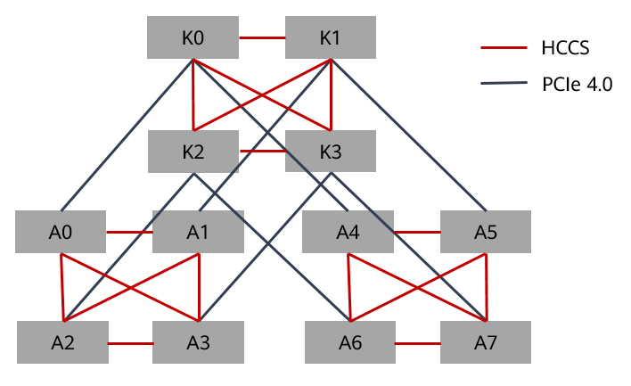
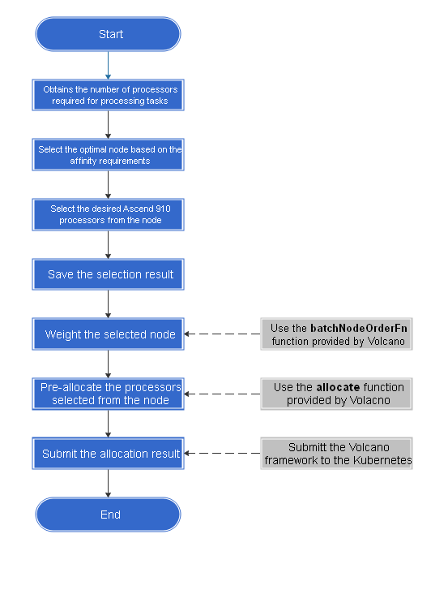

# NPU Affinity Scheduling Algorithm Design and Development Guide
-   [Affinity Policies](#affinity-policies.md)
-   [Scheduling Algorithm Design](#scheduling-algorithm-design.md)
-   [Scheduling Algorithm Implementation](#scheduling-algorithm-implementation.md)
-   [Version Updates](#version-updates.md)
<h2 id="affinity-policies.md">Affinity Policies</h2>

## Ascend 910 AI Processor  Affinity Principles<a name="section14879332111413"></a>

The  Ascend 910 AI Processor  is a high-performance AI processor developed by Huawei. The internal processors are connected in HCCS mode. Each physical device has eight processors and two HCCS rings. Each HCCS ring has four processors. The processors in the same HCCS can perform gradient switching, and processors in different HCCS cannot communicate with each other. That is, the  Ascend 910 AI Processors allocated to the same pod \(if the number of processors is less than or equal to 4\) must be in the same HCCS ring. Otherwise, the job fails to be executed.  [Figure 1](#fig997414281914)  shows the  Ascend 910 AI Processor  interconnection topology.

**Figure  1** Ascend 910 AI Processor  interconnection topology<a name="fig997414281914"></a>  


> **NOTE:** 
>A0 to A7 in the figure are  Ascend 910 AI Processors.

## Affinity Policies<a name="section1024522919366"></a>

[Table 1](#table644103781119)  lists the  Ascend 910 AI Processor  affinity policies formulated based on the characteristics and resource utilization rules of the  Ascend 910 AI Processor.

**Table  1** Ascend 910 AI Processor  affinity policies

<a name="table644103781119"></a>
<table><thead align="left"><tr id="row12441737121113"><th class="cellrowborder" valign="top" width="10.35103510351035%" id="mcps1.2.4.1.1"><p id="p583914346125"><a name="p583914346125"></a><a name="p583914346125"></a>Priority</p>
</th>
<th class="cellrowborder" valign="top" width="20.072007200720073%" id="mcps1.2.4.1.2"><p id="p9839163421215"><a name="p9839163421215"></a><a name="p9839163421215"></a>Policy Name</p>
</th>
<th class="cellrowborder" valign="top" width="69.57695769576956%" id="mcps1.2.4.1.3"><p id="p1183973414121"><a name="p1183973414121"></a><a name="p1183973414121"></a>Details</p>
</th>
</tr>
</thead>
<tbody><tr id="row1544143719118"><td class="cellrowborder" valign="top" width="10.35103510351035%" headers="mcps1.2.4.1.1 "><p id="p65701144151214"><a name="p65701144151214"></a><a name="p65701144151214"></a>1</p>
</td>
<td class="cellrowborder" valign="top" width="20.072007200720073%" headers="mcps1.2.4.1.2 "><p id="p15708447120"><a name="p15708447120"></a><a name="p15708447120"></a>HCCS affinity scheduling</p>
</td>
<td class="cellrowborder" valign="top" width="69.57695769576956%" headers="mcps1.2.4.1.3 "><a name="ul358513316613"></a><a name="ul358513316613"></a><ul id="ul358513316613"><li>If the number of applied <span id="ph102514522379"><a name="ph102514522379"></a><a name="ph102514522379"></a>Ascend 910 AI Processor</span>s is 1, the optimal choice is the remaining one <span id="ph3545191818389"><a name="ph3545191818389"></a><a name="ph3545191818389"></a>Ascend 910 AI Processor</span> in the same HCCS, and the less optimal choices are three <span id="ph58580493183"><a name="ph58580493183"></a><a name="ph58580493183"></a>Ascend 910 AI Processor</span>s, two <span id="ph757645141810"><a name="ph757645141810"></a><a name="ph757645141810"></a>Ascend 910 AI Processor</span>s, and then four <span id="ph03601153191814"><a name="ph03601153191814"></a><a name="ph03601153191814"></a>Ascend 910 AI Processor</span>s.</li><li>If the number of applied <span id="ph64685182196"><a name="ph64685182196"></a><a name="ph64685182196"></a>Ascend 910 AI Processor</span>s is 2, the optimal choice is the remaining two <span id="ph673153064114"><a name="ph673153064114"></a><a name="ph673153064114"></a>Ascend 910 AI Processor</span>s in the same HCCS, and the less optimal choices are four <span id="ph8405174820196"><a name="ph8405174820196"></a><a name="ph8405174820196"></a>Ascend 910 AI Processor</span>s and then three <span id="ph4423165012198"><a name="ph4423165012198"></a><a name="ph4423165012198"></a>Ascend 910 AI Processor</span>s.</li><li>If the number of applied <span id="ph107551285403"><a name="ph107551285403"></a><a name="ph107551285403"></a>Ascend 910 AI Processor</span>s is 4, the remaining four <span id="ph101010328402"><a name="ph101010328402"></a><a name="ph101010328402"></a>Ascend 910 AI Processor</span>s in the same HCCS must be selected.</li><li>If the number of applied <span id="ph1486844612216"><a name="ph1486844612216"></a><a name="ph1486844612216"></a>Ascend 910 AI Processor</span>s is 8, all 8 <span id="ph18561524104212"><a name="ph18561524104212"></a><a name="ph18561524104212"></a>Ascend 910 AI Processor</span>s of the node are selected.</li></ul>
</td>
</tr>
<tr id="row15441837181112"><td class="cellrowborder" valign="top" width="10.35103510351035%" headers="mcps1.2.4.1.1 "><p id="p1157094431215"><a name="p1157094431215"></a><a name="p1157094431215"></a>2</p>
</td>
<td class="cellrowborder" valign="top" width="20.072007200720073%" headers="mcps1.2.4.1.2 "><p id="p16281203414511"><a name="p16281203414511"></a><a name="p16281203414511"></a><span id="ph4280143410458"><a name="ph4280143410458"></a><a name="ph4280143410458"></a>Ascend 910 AI Processor</span> troubleshooting and compatibility</p>
</td>
<td class="cellrowborder" valign="top" width="69.57695769576956%" headers="mcps1.2.4.1.3 "><p id="p18164919174612"><a name="p18164919174612"></a><a name="p18164919174612"></a>If the capacity of a node with a faulty <span id="ph8163121964615"><a name="ph8163121964615"></a><a name="ph8163121964615"></a>Ascend 910 AI Processor</span> is less than 8, the node is stilled preferentially scheduled. The priority of a node, however, must be set to a lower value. That is, a node of the current priority can be selected only when no node of the previous priority meets the requirement.</p>
</td>
</tr>
<tr id="row134514378111"><td class="cellrowborder" valign="top" width="10.35103510351035%" headers="mcps1.2.4.1.1 "><p id="p95701244191213"><a name="p95701244191213"></a><a name="p95701244191213"></a>3</p>
</td>
<td class="cellrowborder" valign="top" width="20.072007200720073%" headers="mcps1.2.4.1.2 "><p id="p25701844191218"><a name="p25701844191218"></a><a name="p25701844191218"></a>Full priority scheduling</p>
</td>
<td class="cellrowborder" valign="top" width="69.57695769576956%" headers="mcps1.2.4.1.3 "><p id="p257014461213"><a name="p257014461213"></a><a name="p257014461213"></a>AI servers that have been allocated with <span id="ph674816913476"><a name="ph674816913476"></a><a name="ph674816913476"></a>Ascend 910 AI Processor</span>s are preferentially scheduled to reduce fragments.</p>
<a name="ul492757985"></a><a name="ul492757985"></a><ul id="ul492757985"><li>If the number of applied <span id="ph156001429162716"><a name="ph156001429162716"></a><a name="ph156001429162716"></a>Ascend 910 AI Processor</span>s is 1, the optimal choices are nodes whose capacity is 8 and the number of remaining available processors in the HCCS is 1, and the less optimal choices are nodes whose number of remaining available processors is 3, 2, or 4.</li><li>If the number of applied <span id="ph121716318401"><a name="ph121716318401"></a><a name="ph121716318401"></a>Ascend 910 AI Processor</span>s is 2, the optimal choices are nodes whose capacity is 8 and the number of remaining available processors in the HCCS is 2, and the less optimal choices are nodes whose number of remaining available processors is 4 or 3.</li><li>If the number of applied <span id="ph25861252174017"><a name="ph25861252174017"></a><a name="ph25861252174017"></a>Ascend 910 AI Processor</span>s is 4, the optimal choices are nodes whose capacity is 8 and the number of remaining available processors in the HCCS is 4.</li><li>If the number of applied <span id="ph26001452134118"><a name="ph26001452134118"></a><a name="ph26001452134118"></a>Ascend 910 AI Processor</span>s is 8, select a node whose capacity is 8 and that has no processor used.</li></ul>
</td>
</tr>
<tr id="row645123716115"><td class="cellrowborder" valign="top" width="10.35103510351035%" headers="mcps1.2.4.1.1 "><p id="p1157004414125"><a name="p1157004414125"></a><a name="p1157004414125"></a>4</p>
</td>
<td class="cellrowborder" valign="top" width="20.072007200720073%" headers="mcps1.2.4.1.2 "><p id="p5570154418121"><a name="p5570154418121"></a><a name="p5570154418121"></a>Even number priority scheduling</p>
</td>
<td class="cellrowborder" valign="top" width="69.57695769576956%" headers="mcps1.2.4.1.3 "><p id="p175701445129"><a name="p175701445129"></a><a name="p175701445129"></a>The HCCS that meets policies 1 to 3 is preferentially selected, and then the HCCS whose number of remaining processors is an even number is selected.</p>
</td>
</tr>
<tr id="row15617913135"><td class="cellrowborder" valign="top" width="10.35103510351035%" headers="mcps1.2.4.1.1 "><p id="p4618141141310"><a name="p4618141141310"></a><a name="p4618141141310"></a>--</p>
</td>
<td class="cellrowborder" valign="top" width="20.072007200720073%" headers="mcps1.2.4.1.2 "><p id="p13570104491211"><a name="p13570104491211"></a><a name="p13570104491211"></a>Multi-node support</p>
</td>
<td class="cellrowborder" valign="top" width="69.57695769576956%" headers="mcps1.2.4.1.3 "><p id="p861812114139"><a name="p861812114139"></a><a name="p861812114139"></a>Only the 8 x N allocation mode is supported for a training job.</p>
</td>
</tr>
</tbody>
</table>

## Resource Application Constraints<a name="section1103513532"></a>

Based on the service model design, the training job requirements are as follows:

1.  If the number of  Ascend 910 AI Processors applied for by a training job is less than or equal to 4, the required  Ascend 910 AI Processors need to be scheduled in the same HCCS.
2.  If the number of  Ascend 910 AI Processors applied for by a training job is 8, the  Ascend 910 AI Processors of the node need to be allocated to the job.
3.  If the number of NPUs to be applied for is greater than 8, the number of NPUs to be applied for must be 8 x N \(N ≥ 1\).
4.  If the number of  Ascend 910 AI Processors applied for by a training job is less than or equal to 8, only one pod can be applied for. If the number is greater than 8, each pod has eight  Ascend 910 AI Processors.

<h2 id="scheduling-algorithm-design.md">Scheduling Algorithm Design</h2>

## Scenarios<a name="section17611254115419"></a>

Based on the affinity policies and service model design,  [Table 1](#table34241172175)  lists the scenarios.

> **NOTE:** 
>-   The four groups from A to D indicate the four HCCL scenarios that meet the processor selection requirements. The priorities are in descending order. That is, B, C, or D is selected only when A does not meet the requirements.
>-   Node status in the group when the HCCS is met. The left part of \~ indicates the HCCS that meets the requirements, and the right part indicates the number of remaining processors in another HCCS. For example, for group A that applies for one processor, the other HCCS may have 0, 1, 2, 3, or 4 remaining processors. The priority of the node decreases accordingly.
>-   To apply for eight or more processors, refer to the scenarios when four or fewer processors are applied for. Additionally, all the processors are in group A and need to be used.

**Table  1**  Affinity policy scenario list

<a name="table34241172175"></a>
<table><thead align="left"><tr id="row164241173174"><th class="cellrowborder" valign="top" width="10%" id="mcps1.2.8.1.1"><p id="p152201253161715"><a name="p152201253161715"></a><a name="p152201253161715"></a><strong id="b192471915014"><a name="b192471915014"></a><a name="b192471915014"></a>Scenario ID</strong></p>
</th>
<th class="cellrowborder" valign="top" width="10%" id="mcps1.2.8.1.2"><p id="p0220115391713"><a name="p0220115391713"></a><a name="p0220115391713"></a>Number of Processors Applied for the Job</p>
</th>
<th class="cellrowborder" valign="top" width="16%" id="mcps1.2.8.1.3"><p id="p152201953111710"><a name="p152201953111710"></a><a name="p152201953111710"></a><strong id="b14350184220117"><a name="b14350184220117"></a><a name="b14350184220117"></a>A (Number of Remaining Processors on a Node)</strong></p>
</th>
<th class="cellrowborder" valign="top" width="16%" id="mcps1.2.8.1.4"><p id="p32211653191716"><a name="p32211653191716"></a><a name="p32211653191716"></a><strong id="b62211753161717"><a name="b62211753161717"></a><a name="b62211753161717"></a>B</strong></p>
</th>
<th class="cellrowborder" valign="top" width="16%" id="mcps1.2.8.1.5"><p id="p3221175312177"><a name="p3221175312177"></a><a name="p3221175312177"></a><strong id="b1222116535179"><a name="b1222116535179"></a><a name="b1222116535179"></a>C</strong></p>
</th>
<th class="cellrowborder" valign="top" width="16%" id="mcps1.2.8.1.6"><p id="p12221145371719"><a name="p12221145371719"></a><a name="p12221145371719"></a><strong id="b12221175317177"><a name="b12221175317177"></a><a name="b12221175317177"></a>D</strong></p>
</th>
<th class="cellrowborder" valign="top" width="16%" id="mcps1.2.8.1.7"><p id="p0221155316175"><a name="p0221155316175"></a><a name="p0221155316175"></a><strong id="b143025501215"><a name="b143025501215"></a><a name="b143025501215"></a>Note</strong></p>
</th>
</tr>
</thead>
<tbody><tr id="row4424317151713"><td class="cellrowborder" valign="top" width="10%" headers="mcps1.2.8.1.1 "><p id="p1822165310172"><a name="p1822165310172"></a><a name="p1822165310172"></a>1</p>
</td>
<td class="cellrowborder" valign="top" width="10%" headers="mcps1.2.8.1.2 "><p id="p1122145319175"><a name="p1122145319175"></a><a name="p1122145319175"></a>1</p>
</td>
<td class="cellrowborder" valign="top" width="16%" headers="mcps1.2.8.1.3 "><p id="p18221195381715"><a name="p18221195381715"></a><a name="p18221195381715"></a>1~[0, 1, 2, 3, 4]</p>
</td>
<td class="cellrowborder" valign="top" width="16%" headers="mcps1.2.8.1.4 "><p id="p5221105315174"><a name="p5221105315174"></a><a name="p5221105315174"></a>3~[0, 2, 3, 4]</p>
</td>
<td class="cellrowborder" valign="top" width="16%" headers="mcps1.2.8.1.5 "><p id="p122211353121711"><a name="p122211353121711"></a><a name="p122211353121711"></a>2~[0, 2, 4]</p>
</td>
<td class="cellrowborder" valign="top" width="16%" headers="mcps1.2.8.1.6 "><p id="p152210538179"><a name="p152210538179"></a><a name="p152210538179"></a>4~[0, 4]</p>
</td>
<td class="cellrowborder" rowspan="3" valign="top" width="16%" headers="mcps1.2.8.1.7 "><p id="p52212053191710"><a name="p52212053191710"></a><a name="p52212053191710"></a>Set a node whose capacity to 7. A bad processor is regarded as used. Repeat from A to D.</p>
</td>
</tr>
<tr id="row8425141731712"><td class="cellrowborder" valign="top" headers="mcps1.2.8.1.1 "><p id="p5221185391719"><a name="p5221185391719"></a><a name="p5221185391719"></a>2</p>
</td>
<td class="cellrowborder" valign="top" headers="mcps1.2.8.1.2 "><p id="p42221531172"><a name="p42221531172"></a><a name="p42221531172"></a>2</p>
</td>
<td class="cellrowborder" valign="top" headers="mcps1.2.8.1.3 "><p id="p132224533174"><a name="p132224533174"></a><a name="p132224533174"></a>2~[0, 1, 2, 3, 4]</p>
</td>
<td class="cellrowborder" valign="top" headers="mcps1.2.8.1.4 "><p id="p1422275316178"><a name="p1422275316178"></a><a name="p1422275316178"></a>4~[0, 1, 3, 4]</p>
</td>
<td class="cellrowborder" valign="top" headers="mcps1.2.8.1.5 "><p id="p3222553141720"><a name="p3222553141720"></a><a name="p3222553141720"></a>3~[0, 1]</p>
</td>
<td class="cellrowborder" valign="top" headers="mcps1.2.8.1.6 "><p id="p5222153181713"><a name="p5222153181713"></a><a name="p5222153181713"></a>-</p>
</td>
</tr>
<tr id="row94251317191720"><td class="cellrowborder" valign="top" headers="mcps1.2.8.1.1 "><p id="p0222753121719"><a name="p0222753121719"></a><a name="p0222753121719"></a>3</p>
</td>
<td class="cellrowborder" valign="top" headers="mcps1.2.8.1.2 "><p id="p1622285341715"><a name="p1622285341715"></a><a name="p1622285341715"></a>4</p>
</td>
<td class="cellrowborder" valign="top" headers="mcps1.2.8.1.3 "><p id="p622210534170"><a name="p622210534170"></a><a name="p622210534170"></a>4~[0, 1, 2, 3, 4]</p>
</td>
<td class="cellrowborder" valign="top" headers="mcps1.2.8.1.4 "><p id="p142221653131719"><a name="p142221653131719"></a><a name="p142221653131719"></a>-</p>
</td>
<td class="cellrowborder" valign="top" headers="mcps1.2.8.1.5 "><p id="p022205310177"><a name="p022205310177"></a><a name="p022205310177"></a>-</p>
</td>
<td class="cellrowborder" valign="top" headers="mcps1.2.8.1.6 "><p id="p20222155312171"><a name="p20222155312171"></a><a name="p20222155312171"></a>-</p>
</td>
</tr>
<tr id="row16425917201717"><td class="cellrowborder" valign="top" width="10%" headers="mcps1.2.8.1.1 "><p id="p822245351710"><a name="p822245351710"></a><a name="p822245351710"></a>4</p>
</td>
<td class="cellrowborder" valign="top" width="10%" headers="mcps1.2.8.1.2 "><p id="p1522295351713"><a name="p1522295351713"></a><a name="p1522295351713"></a>8</p>
</td>
<td class="cellrowborder" valign="top" width="16%" headers="mcps1.2.8.1.3 "><p id="p1522215532172"><a name="p1522215532172"></a><a name="p1522215532172"></a>8</p>
</td>
<td class="cellrowborder" valign="top" width="16%" headers="mcps1.2.8.1.4 "><p id="p22221853111716"><a name="p22221853111716"></a><a name="p22221853111716"></a>-</p>
</td>
<td class="cellrowborder" valign="top" width="16%" headers="mcps1.2.8.1.5 "><p id="p5222145311710"><a name="p5222145311710"></a><a name="p5222145311710"></a>-</p>
</td>
<td class="cellrowborder" valign="top" width="16%" headers="mcps1.2.8.1.6 "><p id="p142221353191710"><a name="p142221353191710"></a><a name="p142221353191710"></a>-</p>
</td>
<td class="cellrowborder" valign="top" width="16%" headers="mcps1.2.8.1.7 "><p id="p1622255310172"><a name="p1622255310172"></a><a name="p1622255310172"></a>-</p>
</td>
</tr>
<tr id="row10426171715174"><td class="cellrowborder" valign="top" width="10%" headers="mcps1.2.8.1.1 "><p id="p1122210533177"><a name="p1122210533177"></a><a name="p1122210533177"></a>5</p>
</td>
<td class="cellrowborder" valign="top" width="10%" headers="mcps1.2.8.1.2 "><p id="p52222535174"><a name="p52222535174"></a><a name="p52222535174"></a>8 x N</p>
</td>
<td class="cellrowborder" valign="top" width="16%" headers="mcps1.2.8.1.3 "><p id="p32221753191714"><a name="p32221753191714"></a><a name="p32221753191714"></a>0 (All the eight processors are used.)</p>
</td>
<td class="cellrowborder" valign="top" width="16%" headers="mcps1.2.8.1.4 "><p id="p422255312177"><a name="p422255312177"></a><a name="p422255312177"></a>-</p>
</td>
<td class="cellrowborder" valign="top" width="16%" headers="mcps1.2.8.1.5 "><p id="p2223135321712"><a name="p2223135321712"></a><a name="p2223135321712"></a>-</p>
</td>
<td class="cellrowborder" valign="top" width="16%" headers="mcps1.2.8.1.6 "><p id="p142231353121714"><a name="p142231353121714"></a><a name="p142231353121714"></a>-</p>
</td>
<td class="cellrowborder" valign="top" width="16%" headers="mcps1.2.8.1.7 "><p id="p192231753141710"><a name="p192231753141710"></a><a name="p192231753141710"></a>-</p>
</td>
</tr>
</tbody>
</table>

## Algorithm Design<a name="section95222037117"></a>

**Figure  1**  Affinity algorithm design process<a name="fig23092914208"></a>  


Key processes in the figure are described as follows:

1.  <a name="li2081354582012"></a>Obtains the number of  Ascend 910 AI Processors applied for processing tasks.
2.  Based on the number of applied  Ascend 910 AI Processors, select the optimal node according to  [Resource Application Constraints](#affinity-policies.md).
3.  Select  Ascend 910 AI Processors that meet the requirements from the selected node.
4.  Save the selection result.
5.  <a name="li205713218818"></a>Weight the selected node.

    > **NOTE:** 
    >Steps  [1](#li2081354582012)  to  [5](#li205713218818)  are implemented in the registration function  **batchNodeOrderFn**  provided by Volcano.

6.  Allocate and manage resources of the selected node.

    > **NOTE:** 
    >This step is implemented in the  **AddEventHandler**  function of Volcano. This function contains the  **allocate**  function for pre-allocating node resources.

7.  After the preceding operations are complete, the Volcano framework submits the allocation result to the API Server of Kubernetes for confirmation, and the allocation completes.

## Troubleshooting Principles<a name="section1844817371912"></a>

The chip fault scenario design covers two steps: initializing four priority groups and selecting nodes.

-   Initializing four priority groups: Add the  **available**  field to the element structure design of the groups. This field indicates the number of available processors on a node. During subsequent group selection, the group with more healthy processors is preferentially selected based on this field.
-   Selecting nodes: Eight \(normal\) nodes are preferentially selected first based on the value of the  **available**  field. If no node is selected from the four groups, the node whose capability is 7 is considered, and then the node with lower capability in sequence.

## Multi-Node Processing Principles<a name="section2038111412211"></a>

This feature is designed based on the Volcano cluster. You only need to use the framework to weight each node and select the optimal node.

Two-phase selection: Four preferred arrays are selected first, and then the final nodes are selected within the arrays. In this way, multiple nodes are considered as a whole.

## Concurrent Processing Principles<a name="section13270122213217"></a>

Volcano does not provide the function callback method in the add method in the allocation phase. Therefore, processors are selected in the node filtering phase. In this way, when jobs are concurrently executed, the chips may be repeatedly allocated.

Repeated allocation may occur in the following two scenarios:

-   Between tasks in a session: When multiple tasks need to be assigned at the same time and multiple tasks can be assigned to a node, the native Volcano only allocates the quantity but does not allocate processor IDs. As a result, the total number of processors is allocated, but a processor may be allocated for multiple times.

    This program uses the  **AddEventHandler**  function provided by the Volcano framework to resolve the problem. The  **allocate**  method of the function is used to manage the allocation of node processors. In this way, repeated allocation is avoided.

-   Between different sessions: In this session, the processors are allocated in the weighting phase. If the resource is waiting to be released, that is, the resource cannot be allocated temporarily, the allocation fails. However, Volcano is not aware of the failure in this session. In the next session, the processor becomes available and will be allocated to another task. In this case, two tasks are allocated to the same processor, and one of the tasks fails.

    One of the solutions to this problem is to determine whether the resource is to be released when processor allocation is performed in the weighting phase. If yes, no allocation is performed in this session.


<h2 id="scheduling-algorithm-implementation.md">Scheduling Algorithm Implementation</h2>

## Process Design<a name="section7199282319"></a>

**Figure  1**  Affinity program process \(Volcano part\)<a name="fig11310145516212"></a>  
.png "affinity-program-process-(volcano-part)")

Some affinity plug-ins are developed based on Volcano. Several plug-in functions are implemented in the volcano-schedule framework. When Volcano runs each session, the implemented function runs according to the compiled rule, implementing affinity scheduling of processors. The affinity scheduling plugin implements the following functions:

-   validJobFn:

    This function is used to intercept jobs that apply for NPU resources. However, the number of applications must meet the affinity policies. For details about the storage space requirements of data stores of different types, see  [Affinity Policies](#affinity-policies.md).

-   AddPredicateFn:

    This function is used to filter out nodes that do not meet affinity requirements. For example, if the task applies for two processors, but each of the two HCCSs on the node has one processor, the node meets the quantity requirement but does not meet the affinity requirement. Therefore, the node needs to be excluded.

-   AddBatchNodeOrderFn:

    This function is used to select nodes whose processors meet the affinity requirement, and put the result into a pod.

-   AddEventHandler:

    This function is used to manage the available  Ascend 910 AI Processors of a node in a unified manner. This prevents incorrect allocation in the case of concurrent operations.


## Affinity Plugin Deployment<a name="section6944039132"></a>

1.  Register the affinity plugin in the framework.

    Add the following information to the  **volcano.sh/volcano/pkg/scheduler/plugins/factory.go**  file:

    ```
    framework.RegisterPluginBuilder(topology910.PluginName, topology910.New)
    ```

2.  Modify the following content in the deployment configuration file  **volcano.sh/volcano/installer/volcano-development.yaml**:

    ```
    apiVersion: v1
    kind: ConfigMap
    metadata:
      name: volcano-scheduler-configmap
      namespace: volcano-system
    data:
      volcano-scheduler.conf: |
        actions: "enqueue, allocate, backfill"
        tiers:
        - plugins:
          - name: priority
          - name: gang
          - name: conformance
          - name: topology910
    ```

    Add the following information to the  **volcano/installer/helm/chart/volcano/config/volcano-scheduler.conf**  and  **volcano-scheduler-ci.conf**  files:

    ```
    tiers:
    - plugins:
      - name: priority
      - name: gang
      - name: conformance
      - name: topology910
    - plugins:
      - name: drf
      - name: predicates
      - name: proportion
      - name: nodeorder
      - name: binpack
    ```

3.  Modify the default configuration of the program.

    Add the following information to the  **volcano.sh/volcano/pkg/scheduler/util.go**  file:

    ```
    var defaultSchedulerConf = `
    actions: "enqueue, allocate, backfill"
    tiers:
    - plugins:
      - name: priority
      - name: gang
      - name: topology910
    - plugins:
      - name: drf
      - name: predicates
      - name: proportion
      - name: nodeorder
    
    ```


<h2 id="version-updates.md">Version Updates</h2>

<a name="table7854542104414"></a>
<table><thead align="left"><tr id="row785512423445"><th class="cellrowborder" valign="top" width="33.33333333333333%" id="mcps1.1.4.1.1"><p id="p19856144274419"><a name="p19856144274419"></a><a name="p19856144274419"></a>Version</p>
</th>
<th class="cellrowborder" valign="top" width="33.33333333333333%" id="mcps1.1.4.1.2"><p id="p3856134219446"><a name="p3856134219446"></a><a name="p3856134219446"></a>Date</p>
</th>
<th class="cellrowborder" valign="top" width="33.33333333333333%" id="mcps1.1.4.1.3"><p id="p585634218445"><a name="p585634218445"></a><a name="p585634218445"></a>Description</p>
</th>
</tr>
</thead>
<tbody><tr id="row118567425441"><td class="cellrowborder" valign="top" width="33.33333333333333%" headers="mcps1.1.4.1.1 "><p id="p08571442174415"><a name="p08571442174415"></a><a name="p08571442174415"></a>v0.4.0-r03</p>
</td>
<td class="cellrowborder" valign="top" width="33.33333333333333%" headers="mcps1.1.4.1.2 "><p id="p38571542154414"><a name="p38571542154414"></a><a name="p38571542154414"></a>2020-09-30</p>
</td>
<td class="cellrowborder" valign="top" width="33.33333333333333%" headers="mcps1.1.4.1.3 "><p id="p5857142154415"><a name="p5857142154415"></a><a name="p5857142154415"></a>This issue is the first official release.</p>
</td>
</tr>
</tbody>
</table>

